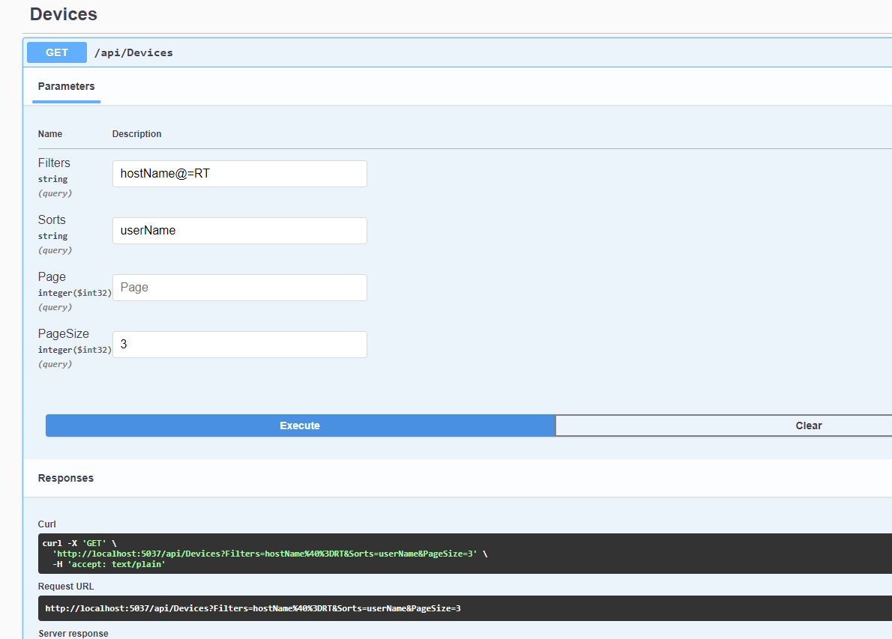

# DevicesManager.Client

Is an application for collecting information about current devices. 
Those information will be sent to the server. The server url should be specified in appsettings.json, for example, :
		
		{
			"ServerHubUrl": "http://localhost:5037/devicesHub" 
		}
		
		
		
# DevicesManager.Server
is a server application for collecting device information and offers a REST API.

How to use API filtering, sorting and pagination:
GET /Devices

		{
			?sorts=     hostName,-id         // sort by hostName, then descendingly by id 
			&filters=   userName@=RT,     // filter devices where a hostName contains the phrase "RT"
			&page=      1                                       // get the first page...
			&pageSize=  3                                      // ...which contains 3 devices
		}
 More information in : https://github.com/Biarity/Sieve 

Swagger UI example:

		
